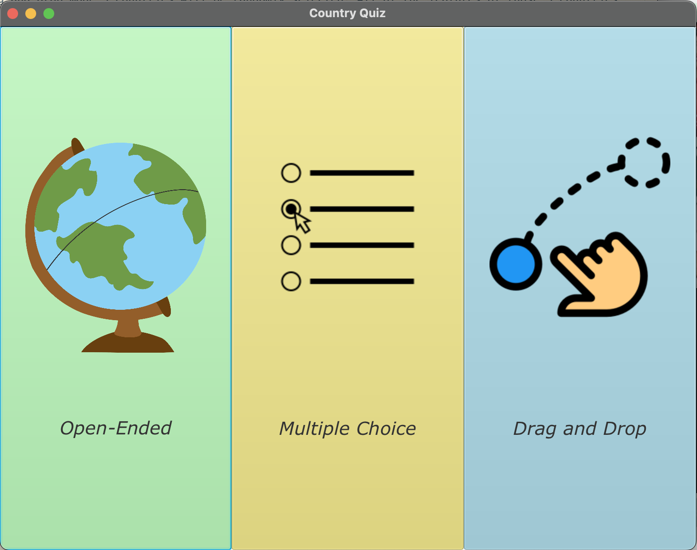
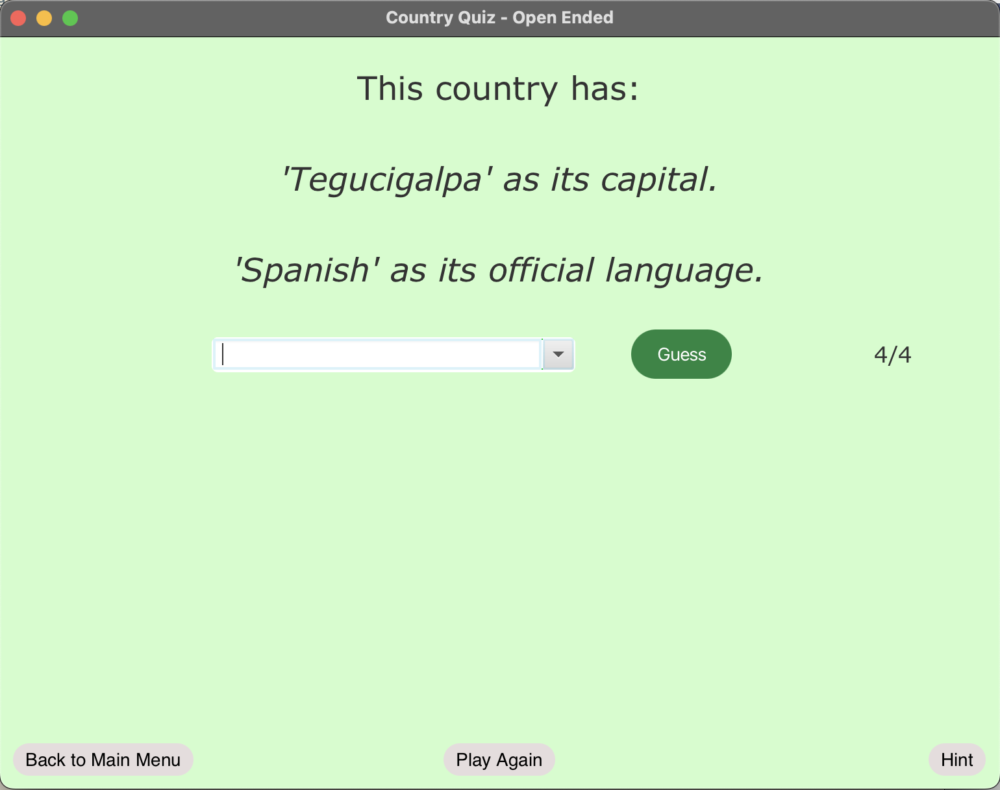
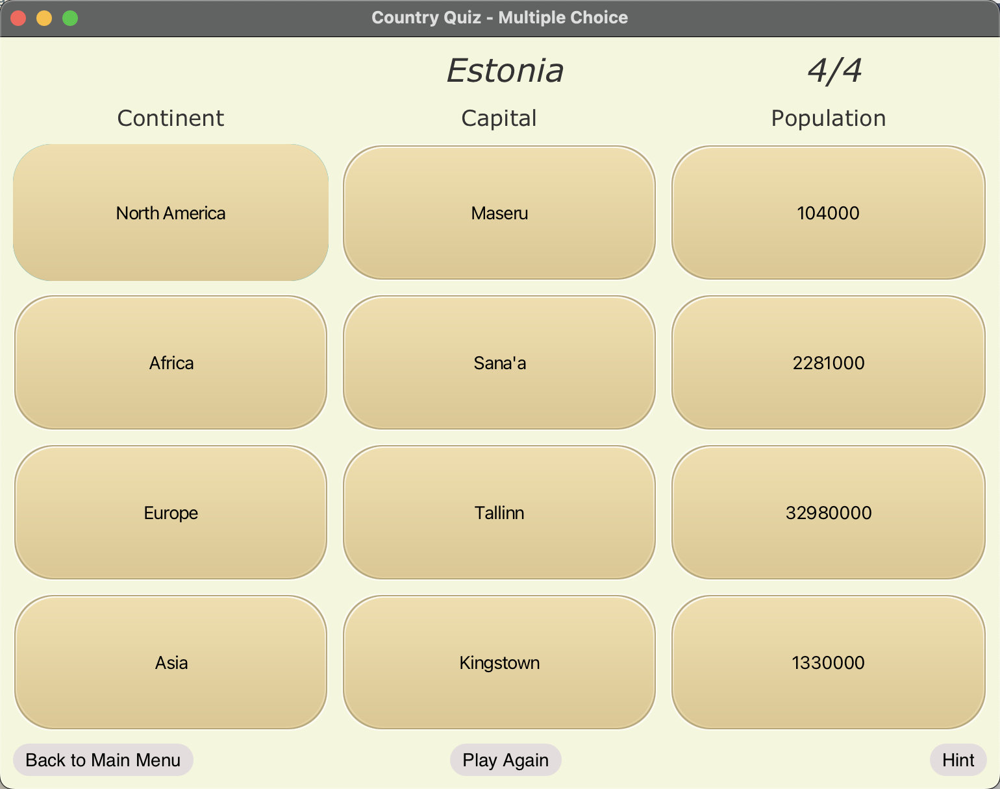
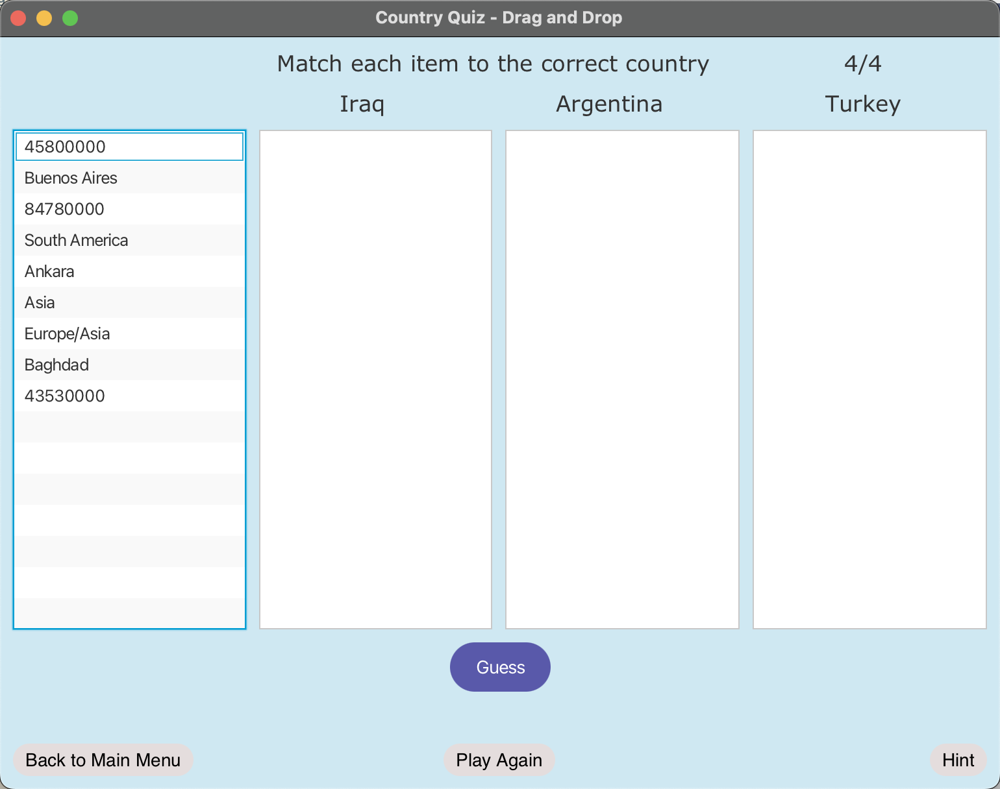

# Project Proposal
## Purpose
For the final project we will be implementing an 'interactive quiz game' that asks players to guess the correct nation based on some 
information provided about the nation, more specifically the capital city, continent it's in, population, and official languages.
We will be implementing 3 different game modes, "Open-Ended", "Multiple Choice", and "Drag And Drop". 
Each  game mode will have a separate scene of their own, created in response to the player selecting that game mode. Each scene will have a unique affordances and appearance that will accomodate the difference in the method of interaction. 
Images of the GUI design will be attached.

## Technical Outline
We will include a brief splash screen that introduces the title of the game to the user. Once the splash screen is done playing the main menu scene will be created and displayed. The entire main menu will be buttons, which start their respective game modes once clicked. Each button will have a relevant graphic on it as well as the name of the mode. Each game mode will have a unique color scheme.

In order to store the data on countries, which will be used to generate the questions, we will have a seprate class called "Country" and "CountryData" to define Country objects and the HashMap of countries the main class will have access to.
We will have GridPane as our base and will create the corresponding scene on the go in response to user actions.

In Open Ended mode two hints about a randomly selected country will be displayed. The user will use a combox that lists all the possible countries to select a country from. The user will press "Guess" button to make a guess. The user will have 4 chances to guess the correct country before the game is over and each wrong guess will be displayed on the screen. When the user runs out of chances without getting the right answer, the correct answer will be displayed.

In Multiple Choice mode, 4 countries will be randomly selected and one of those 4 countries will be selected as the 'answer' country. There will be a column of "continent" buttons, a column of "capital" buttons, and a column of "population" buttons. Each column will have buttons that names a certain feature of a country. In order to win, the user will have to guess the features that belong to the 'answer' country from each of the columns. If the user runs out of chances the correct buttons will be indicated. 

In Drag and Drop mode 3 countries will be randomly selected. All of the features of those 3 countries will be displayed in a source list in a random order. The user will have to drag each of the features into the correct target list to win the game. The correct answers will be displayed if the game is over.

Each game mode will have their own unique "hint" functionality that provides help.

Each mode will also have navigator buttons at the bottom that will allow the user to navigate back to the main menu and thus different game modes. They will also have play again buttons that will refresh the game and displays a new scene.

## Bibliography
We are planning to take inspirations from the books we found in the library, which are "Design, Create, Thrill" by Sara Caldas, "Graphic Design Thinking: Beyond Brainstorming" by Ellen Luptor and "How Design Makes Us Think and Feel and Do Things" by Sean Adams. 
We will also consult Java and JavaFX APIs online to help our implementation process.

Combobox Autocomplete: https://stackoverflow.com/questions/19924852/autocomplete-combobox-in-javafx

Listview Drag and Drop: https://examples.javacodegeeks.com/java-development/desktop-java/javafx/event-javafx/javafx-drag-drop-example/

## Objectives
1. Include a splash screen with relevant graphics to catch the attention of the users.
2. Main menu/mode selection screen with unique images that represent/describe each game mode.
3. Implement drag and drop interaction for one of the game modes.
4. Build a separate 'country' class and keep track of country data in a list to facilitate retrieving and updating of the data.
5. Include navigator widgets that will allow players to easily move between different scenes(modes) and the main menu.
6. Give feedback to the user when the game is over (display the right answers).
7. Use Java Random class to randomly pick out a country from the list to generate questions and keep a separate list of countries that have been used in questions.
8. Add 'hint' functionality to the game to help out the player when they are stuck.